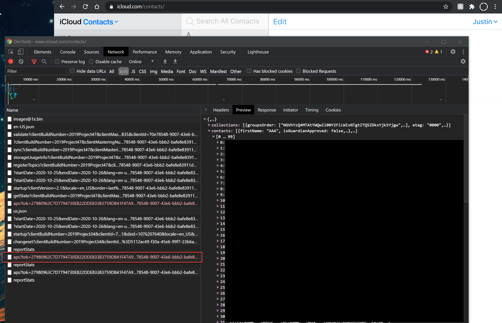

# contact_converter
used to transfer icloud contacts to google contacts

1. download icould contacts
    * go to icloud.com/contacts/
    * used inspect > network 
    * refresh browser
    * find which ones has your contacts in it
    * 
    * go to the "response" tab and copy and paste these to a file
    * name it "contacts.json" and place it in the root
2. run the python script
    * this will create "contacts.csv"
3. import into google contacts
    * go to contacts.google.com
    * import file
  

for more info - read the code